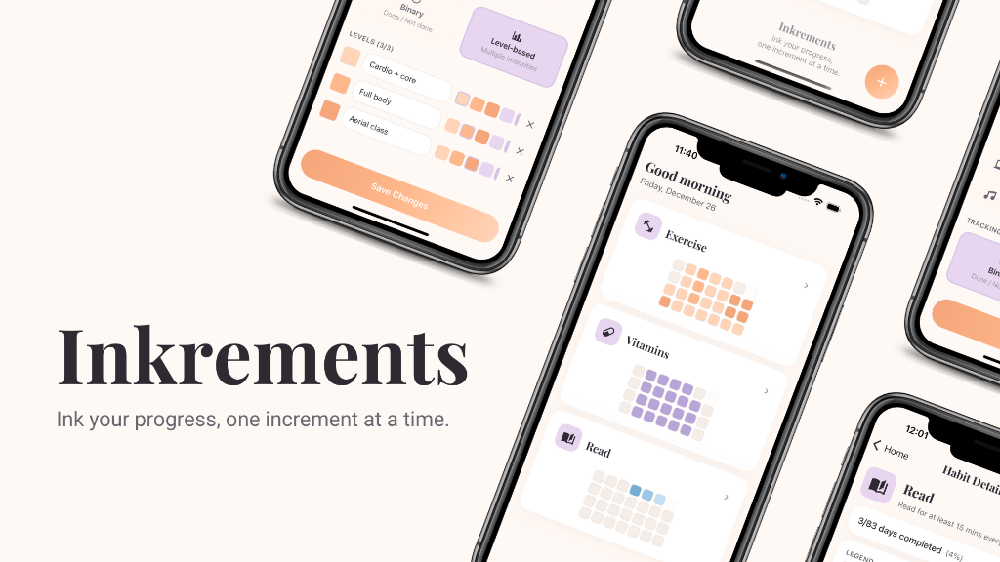

# Inkrements

A personal habit-tracking application inspired by GitHub's tile-based contribution graph. **Inkrements** combines "ink" (the act of jotting things down) and "increments" (gradual progress) to help you visualize and maintain consistency in your daily habits.


## ✨ Features

### Habit Management
- **Create custom habits** with personalized icons and names
- **Two tracking modes**: Binary (done/not done) or Level-based (varying intensities)
- **Organized list view** to manage all your habits
- **Edit and delete** habits with confirmation prompts
- **9 warm color options** for level customization (peach, coral, lavender, purple, blue tones)

### Progress Tracking
- **GitHub-style tile grid** visualization (7 columns for days of the week)
- **Tap to log** progress for today or backfill any past date
- **Long-press to edit** or delete existing progress entries
- **Multiple date ranges**: View 4, 8, 12, 26, or 52 weeks of history
- **Personalized greeting** that changes based on time of day

### Level-Based Habits
- Define **2-3 custom intensity levels** (e.g., 15min, 30min, 60+ min)
- Assign **warm color shades** to distinguish levels visually
- View **level legend** in detail view for quick reference

### Data & Statistics
- **Completion rate** display (e.g., "15/28 days completed")
- **Local-first storage**: SQLite on mobile, AsyncStorage on web
- **100% offline capable** - no internet required
- **Data persists** across app launches and device restarts
- **Data Export**: Export your complete history to JSON or CSV formats


### Design Philosophy
- **Modern wellness aesthetic** with warm peach, coral, and lavender tones
- **Elegant serif typography** (Playfair Display) for headlines
- **Soft shadows** replacing hard borders for depth
- **Gradient accents** on primary actions
- **Time-based personalization** with contextual greetings
- Clean, spacious layouts with clear visual hierarchy
- Responsive design optimized for mobile devices

## 🎯 Use Cases

- **Fitness tracking**: Log workout intensity levels (light, moderate, intense)
- **Reading habits**: Track reading time with multiple duration levels
- **Mindfulness**: Simple binary tracking for meditation or journaling
- **Learning**: Monitor study sessions with intensity tracking
- **Health**: Track water intake, sleep quality, or medication

## 📸 Screenshots




## 🚀 Getting Started

### Prerequisites

- Node.js 18+ and npm
- Expo CLI
- iOS Simulator (macOS) or Android Studio (for mobile testing)

### Installation

1. **Clone the repository**
   ```bash
   git clone https://github.com/your-username/inkrements.git
   cd inkrements
   ```

   > **Note**: If you fork this project, update the `bundleIdentifier` in `app.json` (iOS) and `package` in `app.json` (Android) to use your own identifier.

2. **Install dependencies**
   ```bash
   npm install
   ```

3. **Run health check** (optional but recommended)
   ```bash
   npm run health-check
   ```
   This proactively checks for common issues like corrupted node_modules, port conflicts, and TypeScript errors.

4. **Start the development server**
   ```bash
   npx expo start
   ```

5. **Run on your device**
   - **iOS**: Press `i` in the terminal or scan QR code with Expo Go
   - **Android**: Press `a` in the terminal or scan QR code with Expo Go
   - **Web**: Press `w` in the terminal or visit `http://localhost:8081`

### Building for Production

This project is configured with EAS Build for creating production-ready builds:

```bash
# Install EAS CLI globally
npm install -g eas-cli

# Login to your Expo account
eas login

# Build for iOS or Android
eas build --platform ios
eas build --platform android
```

For detailed deployment instructions, see the [Deployment Guide](docs/DEPLOYMENT.md).

## 🛠️ Useful Commands

### Development Scripts

```bash
# Start the app
npm start              # Start Expo dev server
npm run ios            # Start and open in iOS simulator
npm run android        # Start and open in Android emulator
npm run web            # Start and open in browser

# Maintenance
npm run health-check   # Check for common issues (corrupted node_modules, port conflicts, etc.)
npm run clean          # Clear Metro and Expo caches
npm run clean:all      # Remove all build artifacts (requires npm install after)
npm run reset          # Nuclear option: clean everything and reinstall

# Code Quality
npm run typecheck      # Run TypeScript compiler without emitting files
npm run lint           # Run ESLint (if configured)
```

### When to Use Each Command

- **`npm run health-check`**: Run this before starting work or when experiencing issues
- **`npm run clean`**: Use when Metro is behaving strangely but node_modules seems fine
- **`npm run reset`**: Use when you suspect corrupted node_modules or after failed npm installs
- **`npm run typecheck`**: Run before committing to catch type errors early

## 🏗️ Project Structure

```
inkrements/
├── index.ts                          # Entry point (registers root component)
├── App.tsx                           # Main app component with navigation
├── app.json                          # Expo app configuration
├── eas.json                          # EAS Build configuration
├── package.json                      # NPM dependencies and scripts
├── tsconfig.json                     # TypeScript configuration
├── assets/                           # Static assets (app icons, splash screens, favicon)
│   ├── icon.png                      # App icon
│   ├── adaptive-icon.png             # Android adaptive icon
│   ├── splash-icon.png               # Splash screen icon
│   └── favicon.png                   # Web favicon
├── docs/                             # Documentation files
│   ├── DEPLOYMENT.md                 # EAS Build and deployment guide
│   ├── MOBILE_TESTING.md             # Mobile testing guide
│   └── REDESIGN_PLAN.md              # Design implementation plan
├── src/
│   ├── components/                   # Reusable UI components
│   │   ├── DateRangeSelector.tsx     # Date range dropdown (4-52 weeks)
│   │   ├── EmptyState.tsx            # Welcome screen for new users
│   │   ├── HabitCard.tsx             # Compact habit card (home screen)
│   │   ├── LevelLegend.tsx           # Color/shade legend display
│   │   ├── LevelSelectorModal.tsx    # Progress level picker modal
│   │   ├── ProgressGrid.tsx          # 7-column weekly grid
│   │   ├── ProgressStatistics.tsx    # Completion rate display
│   │   └── ProgressTile.tsx          # Individual day tile
│   ├── constants/
│   │   ├── colors.ts                 # Warm color palette (peach/coral/lavender)
│   │   ├── icons.ts                  # MaterialCommunityIcons set
│   │   ├── spacing.ts                # Spacing, border radius, shadows
│   │   └── typography.ts             # Font families and text styles
│   ├── models/
│   │   ├── Habit.ts                  # Habit data model
│   │   └── Progress.ts               # Progress entry model
│   ├── screens/
│   │   ├── CreateHabitScreen.tsx     # Create/edit habit form
│   │   ├── HabitDetailScreen.tsx     # Detailed habit view
│   │   ├── HabitDetailScreen.tsx     # Detailed habit view
│   │   ├── HomeScreen.tsx            # Main dashboard with greeting
│   │   └── SettingsScreen.tsx        # App settings and data export
│   ├── services/
│   │   ├── database.ts               # Database initialization
│   │   ├── exportService.ts          # Data export functionality (JSON/CSV)
│   │   ├── habitService.ts           # Habit CRUD operations
│   │   └── progressService.ts        # Progress CRUD operations
│   └── utils/
│       ├── colorUtils.ts             # Color utility functions
│       ├── dateUtils.ts              # Date manipulation (date-fns)
│       ├── greetingUtils.ts          # Time-based greeting logic
│       └── statisticsUtils.ts        # Statistics calculations
├── tasks/                            # Project planning documents
│   ├── prd-inkrements-habit-tracker.md
│   └── tasks-inkrements-habit-tracker.md
└── rules/                            # AI prompt rules/templates
```

## 🛠️ Tech Stack

- **Framework**: React Native (Expo SDK 54)
- **Language**: TypeScript
- **Navigation**: React Navigation (Native Stack)
- **Database**:
  - Mobile: expo-sqlite (SQLite)
  - Web: @react-native-async-storage/async-storage
- **Date Handling**: date-fns
- **Icons**: @expo/vector-icons (MaterialCommunityIcons)
- **Fonts**: @expo-google-fonts/playfair-display, expo-font
- **Gradients**: expo-linear-gradient
- **File Handling**: expo-file-system, expo-sharing
- **UI Components**: React Native core components (FlatList, ScrollView, etc.)

## 📋 Development Roadmap

### v1.0 (Completed) - Grayscale Wireframe
- ✅ Core habit tracking functionality
- ✅ Binary and level-based tracking
- ✅ Progress grid visualization
- ✅ Local data persistence
- ✅ Grayscale UI
- ✅ Expo Go compatible (no custom native modules)

### v2.0 (Current) - Modern Wellness Design ✨
- ✅ Warm color palette (peach, coral, lavender, blue)
- ✅ Serif typography (Playfair Display)
- ✅ Soft shadows and rounded corners
- ✅ Gradient buttons and FAB
- ✅ Time-based personalized greeting
- ✅ Footer branding with tagline
- ✅ 9 color options for habit levels
- ✅ Enhanced visual hierarchy
- ✅ Export functionality (CSV/JSON)

### v3.0 (Future)
- [ ] Drag-and-drop habit reordering (requires custom dev client)
- [ ] Widget support (iOS/Android)
- [ ] Habit archiving
- [ ] Enhanced statistics (streaks, trends)
- [ ] Optional cloud backup/sync
- [ ] Reminder notifications
- [ ] Habit templates
- [ ] Data visualization graphs
- [ ] Dark mode

## 🤝 Contributing

This is currently a personal project, but suggestions and feedback are welcome! Please open an issue to discuss any changes you'd like to propose.

## 📝 Documentation

- [Troubleshooting Guide](docs/TROUBLESHOOTING.md) - **⚠️ Start here if you have issues!** Covers Metro connection errors, corrupted node_modules, and more
- [Mobile Testing Guide](docs/MOBILE_TESTING.md) - Testing on devices, simulators, and troubleshooting
- [Deployment Guide](docs/DEPLOYMENT.md) - EAS Build configuration and deployment instructions
- [Redesign Plan](docs/REDESIGN_PLAN.md) - Complete visual redesign implementation guide
- [Product Requirements Document (PRD)](tasks/prd-inkrements-habit-tracker.md)
- [Task List](tasks/tasks-inkrements-habit-tracker.md)

## 🔧 Troubleshooting

**⚠️ Having issues? See the [Complete Troubleshooting Guide](docs/TROUBLESHOOTING.md) for detailed solutions.**

Common issues covered:
- **Metro bundler connection errors** (WebSocket 1006, "Could not connect to development server")
- **Corrupted node_modules** (duplicate folders causing Metro to hang)
- **Expo start timeout errors**
- **Simulator connection issues**

### Quick Fixes

**App won't load / "Could not connect to development server":**
```bash
# Check for corrupted node_modules
ls node_modules | grep -E " 2$| 3$"

# If you see duplicates, clean reinstall:
rm -rf node_modules package-lock.json
npm install
npx expo start --clear --ios
```

**Metro bundler issues:**
```bash
# Nuclear option - clear everything
npm run clean
npm install
npx expo start --clear
```

### Package compatibility issues
See the [Mobile Testing Guide](docs/MOBILE_TESTING.md#worklets-version-mismatch-error) for detailed troubleshooting steps, especially for:
- Worklets version mismatch errors
- Native module compatibility with Expo Go
- When to use custom development client vs Expo Go

### Web version not loading
The web version uses AsyncStorage for data persistence. Ensure you have `@react-native-async-storage/async-storage` installed:
```bash
npx expo install @react-native-async-storage/async-storage
```

### SQLite issues on mobile
Make sure `expo-sqlite` is properly installed:
```bash
npx expo install expo-sqlite
```

### TypeScript errors
Run type checking:
```bash
npx tsc --noEmit
```

### Version compatibility
Always use `npx expo install` for Expo packages to ensure SDK compatibility:
```bash
npx expo install <package-name>
```

## 📄 License

This project is for personal use. All rights reserved.

## 🙏 Acknowledgments

- Inspired by GitHub's contribution graph
- Icons from MaterialCommunityIcons
- Fonts from Google Fonts (Playfair Display)
- Built with Expo and React Native

---

**Built with ❤️ for better habits, one increment at a time.**

*Small steps, big changes.*
